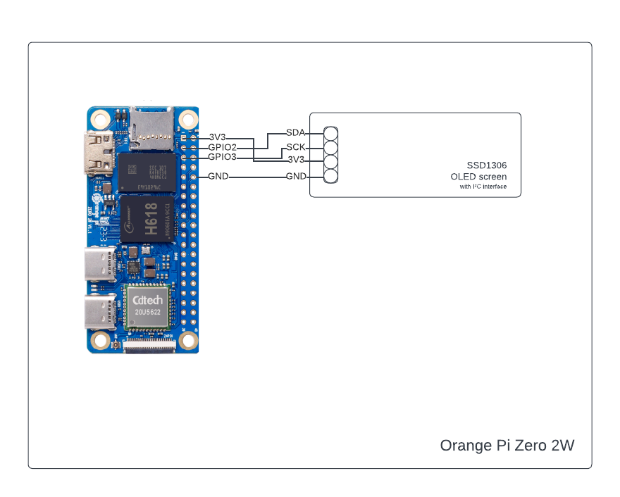
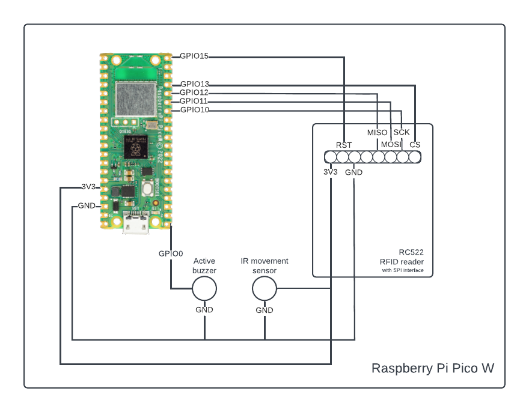
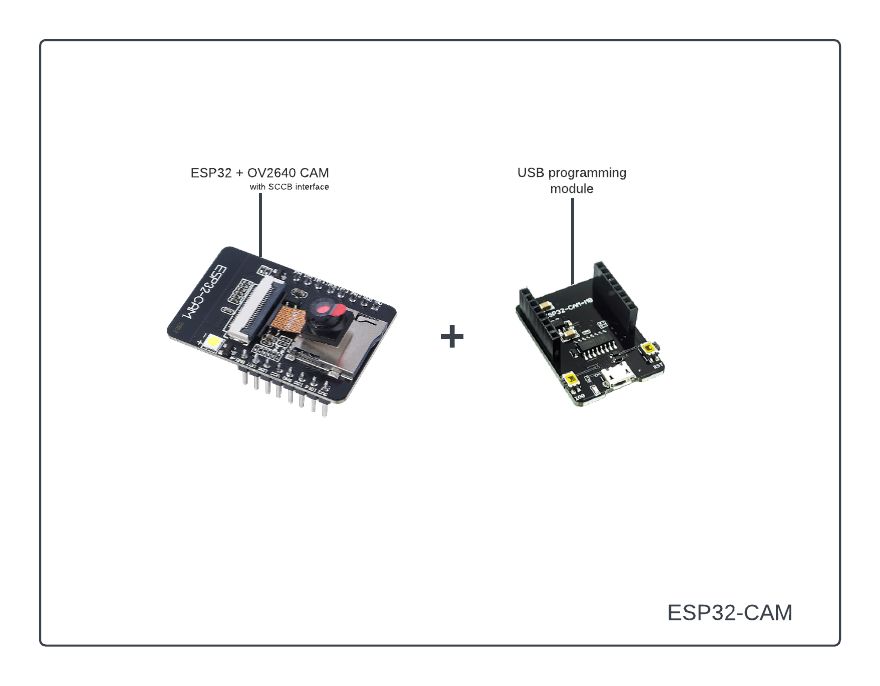

# Cat Proof Alarm System


## Introduction

This project, developed by two students of the University of Trento, aims to create a comprehensive home security system.
The goal is to develop a system that enables users to utilize a motion-based alarm within their homes, even in the presence of pets that might trigger it. Our solution allows users to receive alerts on a webapp upon motion detection, enabling them to view a captured image of the movement and decide whether to activate the alarm. If the user is not there to decide, fear not, the system will also automatically try to detect pesky pets in the image and, if it's successful, it will not sound the alarm.

## Requirements
### Hardware
* Raspberry Pi Pico W
	* RC522 RFID reader
	* IR movement sensor
* ESP32
	* OV2640 CAM
	* USB programming module
* Orange Pi Zero 2W (optional)
	* SSD1306 OLED display (optional)
### Software
* [esptool](https://github.com/espressif/esptool)
* [balena etcher](https://github.com/balena-io/etcher) or similar 
* [docker](https://github.com/microsoft/docker)
* [thonny](https://github.com/thonny/thonny) or [rshell](https://github.com/dhylands/rshell)


## Project Layout
```
[cat_proof_alarm_system]
├── [documentation]
├── [esp_32]						# Controls the camera
│   ├── [firmware]
│   ├── [lib]
│   └── main.py
├── [orange_pi_zero_2w]					# Runs the webserver, the MQTT broker and the controller, controls the display 
│   ├── docker-compose.yaml
│   ├── [controller]
│   │	 ├── controller.py
│   │	 ├── Dockerfile
│   │	 ├── [images]
│   │	 └── [model]
│   │        └── yolov8n.pt
│   ├── [mosquitto]
│   └── [server]
│   	├── server.py
│   	├── Dockerfile
│  	└── [static]
│      	    ├── icon.png
│           ├── index.html
│           ├── script.js
│           └── style.css
├── [raspberry_pi_pico_w]				# Controls the NFC reader, the motion sensor and the buzzer
│   ├── [firmware]
│   ├── [lib]
│   │	├── [umqtt]
│   │	│   └── simple.py
│   │	└── mfrc522.py
│   └── main.py
└── generate_secrets.sh
```
## Getting Started

### Hardware Setup







### Software Setup

First of all, clone this repo in your desired workspace.
After that place yourself inside the cloned directory and run the `generate_secrets.sh` script. This will create the necessary configuration files, with all the required variables that need to be set.
These files can be found at the following paths:

1. raspberry_pi_pico_w/lib/secrets.py
2. esp32/lib/secrets.py
3. orange_pi_zero_2w/.env
4. orange_pi_zero_2w/.authfile
5. orange_pi_zero_2w/mosquitto/passwd

For 1-3, the necessary variables, their meaning and use can be all found in the generated files themselves. 

`.authfile` contains the ids of the RFID devices that are authorized to defuse the system, simply written one per line.

`passwd` contains the `username:password` pair for the MQTT users; includes the default ones, but you can add new ones using the tool [mosquitto_passwd](https://mosquitto.org/man/mosquitto_passwd-1.html)

As for the next steps, each of the three boards require a different setup in order to run the designated code, as explained below

#### Raspberry Pi Pico W

1. Connect the board via USB while holding the BOOTSEL button; your PC will recognize it as a generic mounted storage
1. Drag and drop the file provided in the [firmware folder](raspberry_pi_pico_w/firmware) inside the mounted storage
1. The device will reboot and you will successfully have flashed micropython
1. Using either the Thonny IDE or the rshell CLI as detailed in the [official documentation](https://datasheets.raspberrypi.com/pico/raspberry-pi-pico-python-sdk.pdf), copy both `main.py` and the `lib` folder to the device
1. All set! now you can either simply power on the device and check output via serial communication, or execute it inside Thonny

#### ESP32-CAM

1. Install [esptool](https://docs.espressif.com/projects/esptool/en/latest/esp32/installation.html), a CLI utility to flash the ESP family of boards, by following the provided instructions
1. Clear the flash by running the following:
	
	`esptool.py --chip esp32 --port /dev/ttyUSB0 erase_flash`
1. Flash the file provided in the [firmware folder](esp_32/firmware) by running the following:
	
	`esptool.py --chip esp32 --port /dev/ttyUSB0 write_flash -z 0x1000 {path_to_firmware}`

1. Using either the Thonny IDE or the rshell CLI as above, copy both `main.py` and the `lib` folder to the device
1. All set! now you can either simply power on the device and check output via serial communication, or execute it inside Thonny

#### Orange Pi Zero 2W

1. Download any compatible OS image. There exist an [Armbian](https://www.armbian.com/orange-pi-zero-2w/#) image, a [Dietpi](https://dietpi.com/#downloadinfo) image and a number of officially supported [images](http://www.orangepi.org/html/hardWare/computerAndMicrocontrollers/service-and-support/Orange-Pi-Zero-2W.html) by the manufacturer itself. We used the official Debian Bookworm server [image](https://drive.google.com/drive/folders/1wjhR3YDvZzoBq7UiTYBgAUEWATIPNAjJ)
1. Flash the image to a TF / micro sd card using any of the many available flashing tools, such as [Balena Etcher](https://etcher.balena.io/)
1. Insert the flashed card into the device, power it on and either connect mouse, keyboard and monitor to it, or ssh to it
1. Make sure both [git](https://git-scm.com/book/en/v2/Getting-Started-Installing-Git) and [Docker](https://docs.docker.com/engine/install/) are installed. If not, follow the instructions to install them to the orange pi zero 2w
1. Clone this repo from the device itself via `git clone`
1. Place yourself inside the `orange_pi_zero_2w` folder and run

	`docker compose --profile with-i2c up`

	or

	`docker compose --profile no-i2c up`

	> Note
	> The 'with-i2c' profile will try to initialize I²C interface with ID 1 to connect to the external OLED screen.
	> If your device does not have I²C or you do not have an SSD1306 connected to it, you can use the 'no-i2c' profile.

1. Now the system is up and running!  

### Network Setup

As long as the correct SSID and passwords are set in the devices configuration files, all the components are plug&play. If anything goes wrong and the boards don't seem to communicate, you can use the [mosquitto_sub](https://mosquitto.org/man/mosquitto_sub-1.html)/[mosquitto_pub](https://mosquitto.org/man/mosquitto_pub-1.html) utilities to send messages to the MQTT topics and test the responses from the boards. These are the topics and their use.

- device/online

	This topic is used to send a message when a new device (alarm, camera or webapp) first connects to the network, containing the ID of the new device. It is read by the controller, which adds it to the list of connected devices.

- device/ack/{device_id}

	After a new device sends its id on device/online, it can listen for an ACK on this channel. Depending on the type of device it can receive different data that is important for its function:

	- the webapp receives the status of the alarm (armed/disarmed) to update the GUI and allow the user to interact correctly
	- the alarm receives in each ACK message the ID of an RFID device that is authorized to defuse the system
 

- device/offline

	Is configured as topic of the last will message of the devices (excluding the webapp). Contains as message the ID of the device. When this message is received by the controller, it engages security measures if the alarm is armed and the device was brought offline, as it considers it suspicious activity.

 - image/request

	This topic is used for the alarm to request an image to its associated camera device when triggered, the ID of which is placed as payload of the message. The controller also reads this request and starts the 20 second countdown to the alarm sound.

- image/submit

	After receiving a request, the camera device sends the raw binary data of the JPEG image on this topic, which is then read and processed by the controller to employ its cat detection functionality.

- alarm/rearm

	A message on this topic alerts both the controller and all alarm devices to change their internal status to "armed".

- alarm/rearm/{device_id}

	Alternatively only one alarm device can be targeted, such as when it first goes online and needs to be updated to the "armed" status.

- alarm/disarm

	A message on this topic alerts both the controller and all the alarm devices to change their internal status to "disarmed".

- alarm/sound

	A message on this topic causes all alarm devices to sound their buzzers.

## User Guide

First, the user needs to setup the project as detailed above, then place the three powered up devices in the same WAN. The camera device should point towards the area covered by the motion detection device, which in turn should be placed near any entry point, such as a door or a window. The controller device can be placed anywhere.

In a real life scenario, more than one pair of camera and motion detector can be connected to the same controller device, to setup a more expanded and comprehensive alarm system.

Then, to use the alarm, the user needs to connect to the webapp and authenticate using the form, then they can connect to its alarm system to rearm and disarm it, as well as see the real time feed of pictures as they are taken.

## Links

1. [Canvas presentation]()
1. [Video presentation]()

## Team Members' Contributions

Riccardo Libanora:

- Raspberry pi pico w electronics wiring and code development
- Esp32 code development
- Orange pi zero 2w code development
- Mqtt broker and topics, network setup
- "Getting started" section of documentation

Davide Zanolini: 

- Webapp graphic interface
- Webapp interface to mqtt via websockets 
- Orange pi zero 2w OLED integration
- Documentation
- Presentation

## Additional Notes

- We chose to adopt a combination of Python and Micropython for this project, in order to keep the codebase as small and cohesive as possible; by using a common abstraction layer above hardware that would otherwise require drastically differing libraries, we saved on development complexity and time, not without some compromises.
- While this might be an issue with our specific esp32 board model, there was a problem with its compatibility with Micropython. The pin used for the camera flash on this board was somehow also an hardware reset pin. This lead to strange interactions, such as the flash turning on when connecting to the boards USB and the board getting stuck in this state and reporting as unresponsive. We admittingly didn't give this much thought and just disconnected this pin. The board then worked just fine, with of course the exception of the flash.
- Since all the functionality of the controller device is achieved through Docker containers, you don't actually need an Orange Pi Zero 2W to run that portion of the project. You can run it on any device (embedded or not) and, by connecting it to I²C port 1 on your device and configuring the correct parameter in the .env file, you can also optionally use the external OLED display as instructed above.
