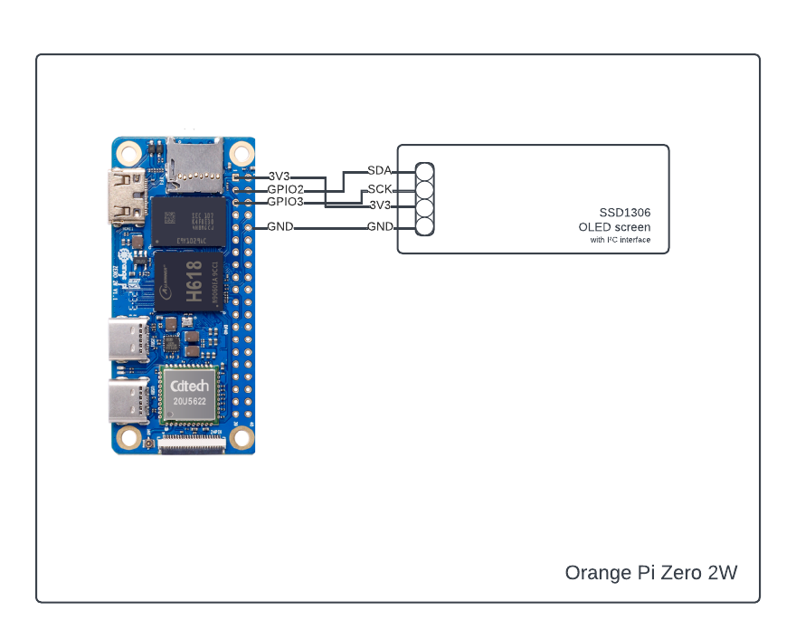

# Cat Proof Alarm System


## Introduction

This project, developed by two students of the University of Trento, aims to create a comprehensive home security system.
The goal is to develop a system that enables users to utilize a motion-based alarm within their homes, even in the presence of pets that might trigger it. Our solution allows users to receive alerts on a webapp upon motion detection, enabling them to view a captured image of the movement and decide whether to activate the alarm. If the user is not there to decide, fear not, the system will also automatically try to detect pesky pets in the image and, if it's successful, it will not sound the alarm.

## Requirements
### Hardware
* Orange Pi Zero 2W
	* Display
* Raspberry Pi Pico W
	* RC522 RFID reader
	* IR movement sensor
* ESP32
	* OV2640 CAM
	* USB programming module
### Software
* esptool
* balena
* docker 
* thonny


## Project layout
```
[cat_proof_alarm_system]
├── [documentation]
├── [esp_32]		# Controls the camera
│   ├── [firmware]
│   ├── [lib]
│   └── main.py
├── [orange_pi_zero_2w]					# Runs the server for the broker and the controller, controls the display 
│   ├── docker-compose.yaml
│   ├── [controller]
│   │	 ├── controller.py
│   │	 ├── Dockerfile
│   │	 ├── [images]
│   │	 └── [model]
│   │        └── yolov8n.pt
│   ├── [mosquitto]
│   └── [server]
│   	├── server.py
│   	├── Dockerfile
│  	└── [static]
│      	    ├── icon.png
│           ├── index.html
│           ├── script.js
│           └── style.css
├── [raspberry_pi_pico_w]				# Controls the NFC reader, the motion sensor and the buzzer
│   ├── [firmware]
│   ├── [lib]
│   │	├── [umqtt]
│   │	│   └── simple.py
│   │	└── mfrc522.py
│   └── main.py
└── generate_secrets.sh
```
## How to run the project

### Hardware setup




### Software setup

First of all, clone this repo in your desired workspace.
After that place yourself inside the cloned directory and run the `generate_secrets.sh` script. This will create the necessary configuration files, with all the required variables that need to be set.
These files can be found at the following paths:

1. raspberry_pi_pico_w/lib/secrets.py
2. esp32/lib/secrets.py
3. orange_pi_zero_2w/.env
4. orange_pi_zero_2w/.authfile
5. orange_pi_zero_2w/mosquitto/passwd

For 1-3, the necessary variables, their meaning and use can be all found in the generated files themselves. 

`.authfile` contains the ids of the RFID devices that are authorized to defuse the system, simply written one per line.

`passwd` contains the `username:password` pair for the MQTT users

As for the next steps, each of the three boards require a different setup in order to run the designated code, as explained below

#### Raspberry pi pico w

1. Connect the board via USB while holding the BOOTSEL button; your PC will recognize it as a generic mounted storage
1. Drag and drop the file provided in the [firmware folder](raspberry_pi_pico_w/firmware) inside the mounted storage
1. The device will reboot and you will successfully have flashed micropython
1. Using either the Thonny IDE or the rshell CLI as detailed in the [official documentation](https://datasheets.raspberrypi.com/pico/raspberry-pi-pico-python-sdk.pdf), copy both `main.py` and the `lib` folder to the device
1. All set! now you can either simply power on the device and check output via serial communication, or execute it inside Thonny

#### Esp32

1. Install [esptool](https://docs.espressif.com/projects/esptool/en/latest/esp32/installation.html), a CLI utility to flash the ESP family of boards, by following the provided instructions
1. Clear the flash by running the following:
	
	`esptool.py --chip esp32 --port /dev/ttyUSB0 erase_flash`
1. Flash the file provided in the [firmware folder](esp_32/firmware) by running the following:
	
	`esptool.py --chip esp32 --port /dev/ttyUSB0 write_flash -z 0x1000 {path_to_firmware}`

1. Using either the Thonny IDE or the rshell CLI as above, copy both `main.py` and the `lib` folder to the device
1. All set! now you can either simply power on the device and check output via serial communication, or execute it inside Thonny

#### Orange pi zero 2w

1. Download any compatible OS image. There exist an [Armbian](https://www.armbian.com/orange-pi-zero-2w/#) image, a [Dietpi](https://dietpi.com/#downloadinfo) image and a number of officially supported [images](http://www.orangepi.org/html/hardWare/computerAndMicrocontrollers/service-and-support/Orange-Pi-Zero-2W.html) by the manufacturer itself. We used the official Debian Bookworm server [image](https://drive.google.com/drive/folders/1wjhR3YDvZzoBq7UiTYBgAUEWATIPNAjJ)
1. Flash the image to a TF / micro sd card using any of the many available flashing tools, such as [Balena Etcher](https://etcher.balena.io/)
1. Insert the flashed card into the device, power it on and either connect mouse, keyboard and monitor to it, or ssh to it
1. Make sure both [git](https://git-scm.com/book/en/v2/Getting-Started-Installing-Git) and [Docker](https://docs.docker.com/engine/install/) are installed. If not, follow the instructions to install them to the orange pi zero 2w
1. Clone this repo from the device itself via `git clone`
1. Place yourself inside the `orange_pi_zero_2w` folder and run

	`docker compose --profile release up`

	> Note: 
	> To run the docker container on a PC, use the profile 'debug'

1. Now the system is up and running!  

## User guide

First, the user needs to setup the project as detailed above, then place the three powered up devices in the same WAN. The camera device should point towards the area covered by the motion detection device, which in turn should be placed near any entry point, such as a door or a window. The controller device can be placed anywhere.

In a real life scenario, more than one pair of camera and motion detector can be connected to the same controller device, to setup a more expanded and comprehensive alarm system.

Then, to use the alarm, the user needs to connect to the webapp and authenticate using the form, then they can connect to its alarm system to rearm and disarm it, as well as see the real time feed of pictures as they are taken.

## Links

1. [powerpoint]()
1. [presentation video]()

## Team members' contributions

Riccardo Libanora:

- Raspberry pi pico w electronics wiring and code development
- Esp32 code development
- Orange pi zero 2w code development
- Mqtt broker and topics, network setup
- "How to run the project" section of documentation

Davide Zanolini: 

- Webapp graphic interface
- Webapp interface to mqtt via websockets 
- Orange pi zero 2w OLED integration
- Documentation
- Presentation
